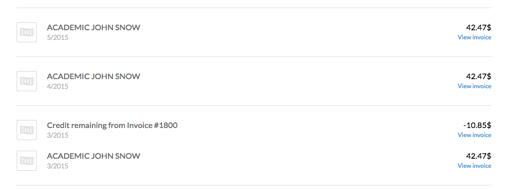

#BEH Meetings
-----
#####Meetings from 2014-07-02 -> 2015
* 9-1 (605) 475-6700 (372835) - code 169-6028
605 475-6700

##2015-09-08 BEH Meeting

###Projects:
* [Resistome (RISE)](#rise)
* [Rio Das Pedras](#rdp)
* [Robin Hood](#robin_hood)
* [Fragile Families](#ff)
* [GIS Data Portal](#data_portal)
* [Admin](#admin)

####Resistome (RISE)
* Completed Geocoding for Subjects and Restaurants
* Construced the following neighborhood definitions:
	* Buffers
		* Radial 0.5 km
		* Radial 1 km 
		* Network 0.5 km
		* Network 1 km
		
* Completed the following variables:
	* Administrative bounds for points
	* Census Demographic variables (ACS 5-year 2008-2011)
	* Farmers Markets
	* Slaughter Houses

* [Data Dictionary Link](https://github.com/nygeog/beh_public/blob/master/resistome/docs/data_dictionary/resistome_data_dictionary_20150820.pdf)
 
 
* To Do: 
	* Maybe Update Slaughterhouses data - geocoding NYS Ag and Market data. Used Quinn 2009 version. 
	* Maybe update Census data to more current ACS? used 2008-2012, maybe us 2009-2013? 
	* Variables in [Time Estimate](https://github.com/nygeog/beh_public/blob/master/resistome/docs/time_estimate/rise_time_estimate_20150715.pdf) Added.
	* Just Completed:

		* Educational  
			* Copied Schools from NAAS project input
				* BEH Schools, includes Charter
				* NYC Schools, does not include Charter 
			* Headstart - geocode
				* Hs_CenterList_2015_06_05_
		* Medical
			* Hospitals 
				* used NYS NYS Medical Facilities Map  
			* NETS for some types
				* NETS here on Echo 
					* /Volumes/Echo/GIS/projects/nets/data/nets.gdb   
				
	* To Do:
		* Variables in [Time Estimate](https://github.com/nygeog/beh_public/blob/master/resistome/docs/time_estimate/rise_time_estimate_20150715.pdf) to add
			* ALL DONE
				
				

####Robin Hood

* Finished 2nd Round of Robin Hood geocoding and added corrected 1st round from surveys. 

* I noticed from the 1st round updates from Matt Maury a note in the spreadsheet caught me eye. "Address doesn't come up on google maps." There was some back and forth emails and Kathy mentioned using: beenVerified and Intellius. Are these services approved by the IRB? If so, and they use the Google Maps API for geocoding or verifying addresses, do these services then violate the IRB? 

####Fragile Families
The last time I used the cold room, Abhishek had setup a Fragile Families user login on Windows. Since going down there, it appears there is a Windows Disk Mounting password that I've never seen before. I've been communicating with Michael Weisner and as of last correspondence he cannot mount the disk. I have the information backed up, even though I was told to remove it from my machine and put in cold room. 

Data is basically ready to go. I'm just waiting on the idnum file in the cold room or I could use my own. 

####Rio Das Pedras
* Incorporated home data shifts (4 corrections) from Garazi. 
* Came up with 2nd time in rdp variable based on each recorded point as a measure of the epoch. 
* Need to create and deliver mapping component of summer time estimate. [Summer Time Estimate Link](https://github.com/nygeog/beh_public/blob/master/rio/docs/201506_summer_time_estimate/rdp_summer_2015_time_estimate.pdf)
* Need to assign points to street segments (see hours on summer time estimate). 

####Admin
* Need to fill out a bunch of more forms to get paid for using paid CartoDB account.  
* Sounds like I won't be able to pay for March. 

####Data Portal

Michael Wisener Notes:

* The module to use the map tool on Drupal sites like the CPRC site is only available for Drupal 7 websites and the CPRC site is based on Drupal 5, so they are not compatible. 
* CUIT can create an interactive frame on a page that would allow the users to use the tool on the CPRC site as though it were compatible, but it would require that the tool and data actually be hosted on a different website like it is now.

* The web team estimated that it would be about 2-3 hours of work and CUIT charges $125 per hour so $250-$375 cost of getting the tool set up. 
* That would not include costs of hosting the tool on another site. I know that GitLab, where it's currently hosted, is free for projects up to 10GB in size but could cost up to approximately $50-$100 per year if the non-free tier was selected.

* Another alternative would be to skip creating the window and just create a link to the GitLab project, which wouldn't cost us anything as I can create that basic page on the CPRC site at any time once the tool is finished and hosted.

##2015-08-11 GIS Call

Plan this week was: 

Robin Hood

* to do 665 geocoding

Driscoll Project

* Change methods to process all GPS points with geoprocessing, then last step would be to match up to ACC data.

They'll get back in a week or two. 

Need - 

* Rise data

RdP

* Holding pattern, wait for Gina
* Epochs question for Gina we talked about last week. 
	* email about 

* Been searching for how to deal with missing data, can't find anything in the literature that shines light on how to deal with it. 

SEND ANDREW RISE TIME ESTIMATE - WORD DOC - 

EMAIL CHRIS again 2-3 days. 

Do we need the crosswalk or do we need to send them this data?

	Andrew has signed off on data dictionary.   
	
	
* UCSD Palms
*

##2015-08-04

* SFTP - email alain and let him know that some data is up there that is not encrypted. 

* 6000 trip segments, what % are pedestrian? 
* for each person, total number of pedestrian trips. 

total number of trips. 

strip Lat,Lng Start and End points. 

* Robin Hood - talk to Kathy on Chris. 

* Massive crime geocoding dataset

* RdP
	* Gather and catalog GPS devices.
	* Shift home points from Garazi's notes.
	* Ask Question about Time connecting epochs. 

		* How far are those points. 
		* Is there an industry standard for GPS missing time. 
			* Ohio State
			* UCSD - Kevin Patrick - see if they have anything on time gaps. 
			

* Time Estimate for Andrew - physical activity and air pollution. northern manhattan/bronx.

Bill time estimate to CPRC - track hours and put CPRC logo on Time Estimate document. Do the same for Robin Hood. 

There are 140 kids for whom there is a 24 hr monitoring period with both GPS and accelerometer (ACC) data and then there is 5 day GPS monitoring period where the last day also included ACC monitoring.  So there are 280 ACC files.  Each ACC file has a header with subject ID, gender age and summary statistics and then time stamped epoch by epoch activity data with counts, energy expenditure and flag telling us if the epoch was a sedentary, light, moderate or vigorous activity epoch.  So you would need to write a script that opens each ACC file and reads the epoch-by-epoch data into a STATA of spreadsheet file.  For each 1 day ACC file there will probably only be at best about an hour of vig or mod activity.  The time stamps from these ACC epochs then need to be used to identify GPS points that occurred during the activity periods.  These activity associated waypoints then need to be characterized   as follows.
 
 
The first step in achieving my overall goal would be to determine MVA that takes place:

1. indoor vs. outdoor
2. in outdoor green space (eg. park, playground, ball fields, track, basketball court, etc.)
3. on sidewalks or roadbeds
 
The next set of variables, which actually get to the primary objectives of the study would be to look at:

1. distance to roadway ≤ 2 lanes
2. distance to roadway > 2 lanes
3. distance to truck route
4. distance to highway
 
I don’t have experience with using the NYCCAS data so I am a bit unfamiliar with how the data is stored. However, if possible I think it would also be interesting to categorize during MVA, exposure to:

1. elemental carbon (we have personal black carbon measurements for the kids so this would be a good variable to use to compare with our personal measurements)
2. PM2.5
3. nitric oxide
4. nitrogen dioxide
5. ozone
6. sulfur dioxide

##2015-07-28

* rise questions - geocoding?
	* 45 homes, 45 restaurants
* rise questions - presence of school - all schools, ask james...
* rise - review/revise time estimate for RISE
* rise - need to track down private and parochial schools. 
* rise - grab addresses

* 650 new Robin Hood Addresses - got the file yesterday.
	* Followup with Kathy to find out if there are additional lines. 

* Received Data Portal Comments
	* Julien
	* Multi user support for uploading data. 
	 
* Driscoll Project

##2015-07-14
###BEH Meeting

#####Data Portal Stuff:
* label the button that make things invisible

* future:
	* percent foriegn born
	* percent hispanic
	* cites to papers that have used the measures 
	* subway data layers
	* export map as pdf 

####Work Queue

#####RISE 
* Time Estimate

####RdP 
* Work through tasks from Summer 2015 Time Estimate

####Fragile Families

##2015-07-07
###BEH Meeting and Monthly GIS Planning Session

####NETS notes
* NETS 52.4 million points

####Work Queue

#####RdP
* Completed and working on part of Task 2 - Tabular data for participants and geoprocessing. 
* Create maps for Sampling Grid.
* For RdP neighborhood intersect, change to near function. Do both intersect yes,no and near distance to RdP polygon.

#####Fulcrum
* Develop a standard Time Estimate for SSO
	* deploy MPH students
	* how much GIS time setup per item, x # points, y # of items
	* time to develop questions roll out revisions. 
	* figure out how long RdP to get an idea of standard time.  

#####Fragile Families 
* Contact Michael Weisner about getting access to cold room and tracking down that file. 
	* note to ask: but don't we not have the right id's. 

#####Rise

* Need to get RISE data from Andrew. 

####Data Portal
* Some of the viz json's aren't working. 
* Darby suggestions:
	* 1) possible to make the data layer slightly more transparent, so that the underlying street grid is easier to see?
	* 2) can the data dictionary list the origin of the data?  maybe give a "suggested citation" somewhere?
* cohd - send rundle time estimate for luchsinger from March 2014

#Other Stuff:

##2015-06-16
####Work Queue
* Working on RdP Summer work Time Estimate.
* Few more days on version 1.0 of the data portal. 
* Get RISE data from Andrew. 
* Jose Luchsinger has got funds for geocoding. Look through documentation.   

####Map Comments
* Dropdown - organized by theme, either with additional buttons. 
* Toggle off variables to see basemap (Leaflet). 
* Maybe turn on/off aerial imagery. - my comment. Not necessary. 
* Add flag field for parks, airports, cemetary, etc.
* Add all walkability components to infoWindow

##2015-06-09
###Monthly GIS Planning Session
1st Tuesday of each month could be our meeting time.

* Data Portal 
	* Build Version 1.0
	* Build workflow and documentation
	* Aim for Version 1.0 July 1.
	* Public Launch in September. 

GIS Projects:

* EDC Data is in-house. 2009-2013 ACS Data
* RISE
	* Microbiology. 45 individuals - swipe bodies w/ cu-tips, then swipes of bathrooms of places in bronx/n. manhattan 45 restaurants. 
	* Geocode and 1 km buffers around them.

* Luchsinger
	* Jose Luchsinger has got funds for geocoding. Look through documentation.   

###BEH Meeting

####BEH Data Portal 

* [BEH Data Portal Presentation](http://beh-gis.github.io/data/presentation)
* [BEH Data Portal](http://beh-gis.github.io/data/)

####Work Queue
* Continue on the data portal master dataset for the geographies
	* [The shared Google Doc with James](https://docs.google.com/document/d/18rnWEFltB_vMM2tLBfkC632t6XhsEzx2HyGlz3NoGh8/edit#heading=h.t5z2nrhek5zs)
* Follow up with 50 ungeocoded addresses for Robin Hood.
* Fragile Families ID - fragile families key memo into P: drive.
* Try and set up an RdP file folder for the BEH server. 

	
####Days Off Request
* 6/25-7/7 - wedding in Colorado - total of 7 days off. 
* Might need to use some other vacation before July 1 so I do not lose accrued days from this past year. 

##2015-06-02

####Work Queue
* Review 50 or so Robin Hood addresses that did not geocode. 
	* All GIS alternatives have been reviewed, if possible RH team could review notes and printed documents. 
	* Results:
		* There are 2081 records in p3m dataset. 
			* 260 that are missing data in field p3m_streetAddress (12.5% of 2081) and thus are ungeocodable to anything finer than a ZIP code or ambiguously along a street polyline. 
			* 1821 in p3m dataset that are not missing address data in the input p3m_streetAddress field (87.5% of 2081). These 1821 records were entered into the geocoding process. 
				* As a result of 3 rounds of geocoding and address and building look ups, 1771 (85.1% of 2081 and 97.3% of 1821) have valid BIN’s (Building Identification Number) and thus valid x,y coordinates.
				* 50 have p3m_streetAddress but have not been geocoded (2.4% of 2081 and 2.7% of 1821) due to errors in the original data entered, not being in New York City, missing address House Number’s or being post office (P.O. boxes) boxes. See Ungeocoded.csv for notes, etc.
	
* Get back on task with Darby's restaurant paper. Find out what he needs to send and what GIS work/mapping needs to be done. 
* Spend some time cleaning up drives and doing some data storage and backup maintenance. 3-4 hours.
* Develop a Time Estimate for Rachel Miller's work.
* Extract and send Garazi the data collected w/ Fulcrum app.
* Prepare map and review text for Andrew's Social Epi blogpost.  
* Fragile Families ID - fragile families key memo into P: drive.
* Try and set up an RdP file folder for the BEH server. 
* Send Kathy the DOH PATS survey PDF.

####GIS queue
* Findley - WIC Locations

##2015-05-22 Call with Andrew 

####Rachel Miller - children's center

* 130 particpants.
* 260 files. 5 seconds or 15 seconds. 
* gps 140 kids n. manhattan and bx 10 year old kids
* 2 days of data, then a week later, 2 more days of data
* gps and time match to accel.
* which gps points are near parks, highways, home, school,
* geocode home addresses, schools
* distance to park. 
* look at tree canopy cover
* describe each waypoint
* home school - how much time is spent in home, and at the school. 
* is this point w/in quarter mile of a truck route near. 
* pct tree canopy variable

##2015-05-19

#####Robin Hood
* There are 2081 in p3m dataset

	* 261 that are missing data in field **p3m_streetAddress** (**13%** of 2081)
	* 1820 in p3m dataset that are Not Missing address data  (**87%** of 2081)

		* Of 1820, 1488 geocoded on first pass with GeoSupport Desktop. (**82%** of 1820, **72%** of the total 2081)	
		* Of 1820, 332 failed. (**18%** of 1820)
			* Of 332, 174 (**52%** of 332) appear to have missing house numbers. 
			* Of 332, 158 (**48%** of 332) appear to have house numbers. 
	
#####RdP
* Received Week 7 GPX data, processed data and updated maps last night. 
	 
##2015-05-12

#####[Black Women's Health Study](http://www.bu.edu/bwhs/)

* Interested in Street View Disorder measures. 
* 50,000 participants. 
* Across US. 
* Every 2 years, 1995 - 2013. Self-reported health data. 
* 2 papers, urbanism predict BMI and walking. 
* Potential 4 city study.
	* Chicago
	* NYC
	* LA
	* Atlanta

###To Do:

#####Rio Das Pedras

* Maps
	* The root folder has each participants GPS traces (**134** maps - 1 map for RdP area, 1 for full feature envelope). 
	* The day folder has each participants GPS traces broken up by day (**580** maps - 1 map for RdP area, 1 for full feature envelope). 
	* **714** maps total 
	

* [Street audit progress on Fulcrum Map](http://beh-gis.github.io/projects/rdp/)
* Using DateTime, adjust the GPX file timestamps to local Brazil time (+3), have them in GMT currently. 
* Add timestamp labels for hours
* Consider adding OpenStreetMap labels using Maplex or some coded label generation script. 
* Add Day of week (Friday…) to dated map title
* Scale bars for very tiny GPS trace extents
* Rerun the export mxd scripts 
* Misc

	* RdP GPX files and password coming from same email address. 
	* RdP GPS devices not wiped, contain NYC 2014 student walks data. 
	* [RdP Map of Orthophoto's restricted by Brazil.](ftp://geoftp.ibge.gov.br/imagens_aereas/ortofoto/projeto_rj_escala_25mil/RJ25_folhas_sigilosas.pdf)

* <strike>Add GPS device id to master database.</strike>

* Ask about how to coordinate to set up a short course in GIS in Rio. 

#####Robin Hood
* Geocoding. Review addresses sent by David/Kathy. 

#####Restaurants
* Send James Census data for Restaurants. 

###Hardware Purchases

* Running low on backup disk space. Need some additional hardware. [4 TB LaCie Drives.](http://www.amazon.com/LaCie-Quadra-External-Drive-9000258U/dp/B00AK9ZT98/ref=sr_1_1?ie=UTF8&qid=1431440758&sr=8-1&keywords=lacie+4+tb) 

###Software Purchases

* Paying out of pocket for CartoDB since March. 
CartoDB Payments 
* $127.41

##2015-05-05
Notes:

* Walkability metric for 1990 NETS 

[Taxi data slideshow](http://stat4701-edav-gps.github.io/)

* start at slide 10

#####To Do: 
* ff - resolve ID crosswalk issue. 
* naas - Kate Weinberger data questions for GIS variables.
* rdp - Preparing maps for RdP field visits. 
* rdp - [RdP Fulcrum blogpost](https://github.com/nygeog/beh_public/tree/master/rio/tasks/201504_fulcrum_blogpost)
	* Community Health Diagnosis - Community Needs Assessment

---

##2015-04-28

* Presenting tonight on our Distributed Building Height Predicting GPS signal error as measured by Average Distance to Roadbed in Census Block. 
	* Should be able to show some slides next week if time permits.
	
* Digging through project from March 2013 for Nicolia.
	* Rush job so, limited documentation.
	
* Planning on updating the online applications for data collection in the field. 

* Preparing maps for RdP field visits. 

* Developing curriculum for teaching open source GIS in Brazil. 

##2015-04-21

Working on:

* RdP mapping for study participant interviews. 

* Sent the NAAS data to Matt P. that I sent to Kate. 

##2015-04-14

GPS notes

* Stratify by block size. 

* Points with value of 0 vs. > 0

Maybe send Kathryn Bartley stationary GPS map. 

##2015-04-07

####To Do:

1) Steve
2) Restaurant inspection. - touch base with James and Darby. 

* Papers:
	* NETS revise Sat. send Tanya comments
	* Steve Walks paper. 

* Schedule RdP meeting. 

* EDC, SPARCS,  

* Check GPS walks from RdP. What is my time comment going forward for RdP? Should we time estimate specific tasks or should we allocate a number of hours per week? 

	* RdP, 44 households completed. 
	* Of those 44, 5 decline GPS, 2 declined oral and water samples.
	* 57% participating of households contacted participated. 
	* Deliverable is Community Health Profile.
	* We want 2 papers:
		* Mobility Patterns - GPS
			* From the same SUID what variation do we see in
				* Time in RdP, time outside
				* Route choice
				
				* Subject variability
				
		* Microbiome.
		* And maybe Blogpost of something on data collection and new technology in Rio. 
	
	
* Figures/Comments for Steve. Which paper is this for (check email)? 
* Fragile Families for Steve. 
* MyNCBI - biosketch fill up and curate for papers. Get this done in 1 Month. 

####Done:
* CPRC map edits. 
* Look up data for Tanya. 
* Tanya email for Esri.
* Streetview - dc and baltimore change distance from 500 m and 1000 m to 1000 m and 2000 m ### UPDATED ['1000','2000'] 

* NAAS - 4 more full days for Network Buffers and documentation. 5 Geographies done for 
	* population density (2000 and 2010 census), 
	* % poverty (2000 and 2010 census), 
	* median household income (2000 and 2010 census), 
	* black carbon and 
	* PM2.5 two-year averages from NYCCAS. 
	* tree canopy (0.5-km radial buffer) to that list.
	* traffic volume, and 
	* % park land 

##2015-03-31
####To Do:
MyNCBI - biosketch fill up and curate for papers. Get this done in 1 Month. 

[Data Haven](http://www.ctdatahaven.org/)

Streetview - dc and baltimore change distance from 500 m and 1000 m to 1000 m and 2000 m ### UPDATED ['1000','2000'] 

####News:

We now have a free academic account with Fulcrum. 

* I agreed that we would write 1-2 blogposts. They'd like them delivered in **Markdown**. 
* We have Unlimited Apps, Unlimited Records, and 7 Data Shares.
* We don't have Geotagged Video Capture (have to pay for that).
* Not sure about Count of Members, it says we have 1, then 6 on another page, then it says we can add members for $0 per new member.

####Work:

* NAAS - 4 more full days for Network Buffers and documentation. 5 Geographies done for 
	* population density (2000 and 2010 census), 
	* % poverty (2000 and 2010 census), 
	* median household income (2000 and 2010 census), 
	* black carbon and 
	* PM2.5 two-year averages from NYCCAS. 
	* tree canopy (0.5-km radial buffer) to that list.
	* traffic volume, and 
	* % park land 

Today I'll be trying to put out a few small projects, 

* CPRC map edits. 
* Figures for Steve. Which paper is this for (check email)? 
* Fragile Families for Steve. 
* Look up data for Tanya. 
* Tanya email for Esri.
* Ask Andrew where Darby (Restaurants falls in the queue).
	* Later priority 1 month(?) 
	
* Check GPS walks from RdP.
* Creating and updating a new Fulcrum form for summer. 
	 * Fulcrum, alert for required for form items.

##2015-03-24

Fulcrum, alert for required for form items

Fulcrum, talk to for 6 month license

##2015-03-10

---

Thank for this, Danny. As Garazi (who’s sitting across from me) just said, they look great!  And the app to facilitate the systematic social observation is well above and beyond anything expected.  It’s going to make the field data collection on the RdP environment much smoother than we had thought, which is good since there are already so many logistics for Garazi and Renata to manage (which amazingly seem to be coming together), in addition to basically teaching the interviewers full time this week.
 
I’m nervous about the grid points being up for an extended period without any password to access them, since they’re so close to our recruitment points.  Garazi has grabbed screenshots of this which we’re carrying into the field, so I think we could take it down, or better yet, password protect.  We’re taking notes anyway about the outside of the building, and taking photos, so it would be simplest now that we’re including a larger segment of the team here just to take paper notes on any deviation between the assigned point location and selected recruitment site.  We can then fix them in fulcrum as a batch back at the office while we’re pulling together photos.
 
Anyway, I just wanted to say thank you.  We’re working to get at least a no cost extension from Medtronic, and will try to figure out if we have additional funds to cover your efforts on this.
 
Obrigada,
Gina

---

Hey Danny, 

This looks awesome! Thanks so much!!! I have a lunch break tomorrow from 12-1 your time or i'll finish the training around 3 your time. Let me know if you'd like to chat during either of those periods. 

The sample points will be different from the street segment questions - the sample points are to identify the buildings and then launch the field teams. Unfortunately none will be "complete" prior to next week. The first would theoretically be complete on either Tuesday or Wednesday, March 24-25. 

The only thing we might want to discuss is the connection between the sample point and grid layer. Gina was out in the field today mapping points and thought that dropping new points might be redundant because the gps dot is a rough approximation anyway (you almost always have to pan across 1-2 streets to get to your location) in which case it might not matter if we do this in the field or do this back in the office. The street segment app and the photos app looks great. I'll try to include photos in the street segment section as well while im walking around but the photos will be a good interface for everyone else who isn't doing the street segment questions. 

Thanks again for putting so much time into this. I think it's going to work really well! 

Best,
Garazi

##2015-03-03

##2015-02-24

Priority:

---

* Rio das Pedras	
	* Sent Garazi info and video's on using GlobalSat DG-100
		* [GlobalSat Info](https://github.com/nygeog/gps/tree/master/devices/globalsat)	
	* Sampling plan - what is it? We need key information about the local projection system for RdP. We need valid neighborhood geographies to generate grid points. 
		* 100 points. 
		* Neighborhood Geographies. 18th of March field work. B/n March 2nd and March 10th Garizi will be in the field. 

---

* NAAS
	* Neighborhood geographies land area created (not including 1 km network buffer areas),
	* Currently processing Census Variables. 
	* All variables
		* These variables are:
			* Population density (2000 and 2010 census)
			* % poverty (2000 and 2010 census)
			* Median household income (2000 and 2010 census)
			* % park land
			* Traffic volume***
			* Black carbon and PM2.5 two-year averages from NYCCAS (Danny, Gina said you would have this data)
			* Tree Canopy
		* The buffer sizes we will need are 
			* 0.25
			* 0.5 
			* 1-km radial buffers 
			* plus 1-km network buffers. 
	* I'll need the krigged surfaces from Kate W. (Zonal Stats). Land Use Regression. 
	
* [WIC Time Estimate](https://github.com/nygeog/beh_public/raw/master/wic/time_estimate/wicnys_time_estimate_20150217.pdf) 
	* 4-8 Weeks, with 119 Count to Geocode WIC Locations. (Independent of using ZIP Code or street address geocode)
	* WIC Vendors data is not currently available. Missing Fitnessgram data - said to get from DOHMH. 
	* SPARKS (Sports, Play and Active Recreation for Kids) is supposedly available from DOHMH.
	* Will need to get estimate from WalkScore. 

* NETS
	* Encrypt and send out NETS data to Bader. 

* SPARCS
	* Got unique ZIP codes by Year from David W. for SPARCS - need to revise the Time Estimate for ZIP codes. 

* Restaurants 
	* Waiting on formatted data from Darby

* GPS Data in Urban Environment (Taxi)
	* Recruited 3 other Data Science students to work on projects. 
	
* [Lion's Challenge](http://www.columbiahealthdatascience.com) - Register by March 6th. 
	* The Center for Health Analytics, part of the Columbia University Data Science Institute, is announcing Lions’ Tracks, an app design competition to support quantified self and facilitate sharing of activity tracking information across the Columbia research community for advancing health research. 	
* [Columbia Venture Competition](http://engineering.columbia.edu/columbia-venture-competition) 	
	* The Columbia Venture Competition was first launched in April 2009, and has paid out more than $100,000 in prize money to early-stage ventures all founded by young Columbia entrepreneurs. Over the years the competition has grown in the number of submissions and in competition quality.

##2015-02-16

---

Recently Completed:

* Wrapped up Transit Project reprocessing 
* and NAAS geocoding (76 hours) on Friday. 
	* Low Estimate

			>>> 1370 * 3
			4110
			>>> 4110/60. 
			68.5 hours estimate

	* High Estimate

			>>> 1370 * 5
			6850
			>>> 6850/60. 
			115.167 hours estimate

* Monday/Weekend - GPS testing (see Rio Das Pedras below)

To Do:

* Findley Estimate (plan to spend next 2 days working on that) - Priority #1

* NAAS Geoprocessing 
* Restaurant Mapping
* BEH master dataset (met with Andrew RII this morning)
* NYC crime data scraper
	* Have 2013 and 2014 by month. Maybe 1-2 days of inspecting and building database.
		 
* What is my percent effort for the Rio project? 

###Rio Das Pedras

* iGotU GPS test:
I tried to carry it all weekend. Friday went down to Crown Heights and then Saturday went to NJ. None of the Saturday trip was captured.  [Here’s my GPS data in a map](http://cdb.io/1zIoM5U)

	* Here’s the time range:
		* 2015-02-13T23:31:28Z
		* 2015-02-14T16:13:59Z

* Field Staff GPS data collection:

	* I just built a CartoDB viz app (~1 hour) that allows for data collection/geotagging and so long as we get the users to have free accounts they can easily add points to a map. They would just need reliable cell service. The locational settings on the cell phone’s don’t need to be super precise as the user can pan and zoom on the map. I put those points on the map using my iPad today. It is much easier to scale this up and we could improve the interface as the project goes on. 

	* [Rio Map](http://dms2203.cartodb.com/viz/596a42a6-b5fd-11e4-adb0-0e0c41326911/embed_map)

* Rio Computer Details:
	* Are the computers hard drives encrypted (if we need to follow Columbia’s IRB protocols)? 
	* Will we have administrative access on them? 
	* Will we be able to log into them via SSL? If so will they have static or dynamic IPs? Being able to log in and share the screen with the GIS staff in Rio will be very helpful to ensure data collection. 

* What is my percent effort on this project? 

---

###NAAS 

* Shooting from the hip, as there was not formal time estimate for this project, I think it'll take about a month to create the neighborhood-level variables.

My understanding is that the next step (from our 10/10/14 email) is calculating a limited set of GIS variables around the successfully geocoded addresses: population density (2000 and 2010 census), % poverty (2000 and 2010 census), median household income (2000 and 2010 census), % park land, traffic volume, and black carbon and PM2.5 two-year averages from NYCCAS. The buffer sizes we agreed on were 0.25, 0.5, and 1-km radial buffers, plus 1-km network buffers. As I mentioned on the phone, we are hoping to add tree canopy (0.5-km radial buffer) to that list. Gina mentioned to me that it might actually save coding time to calculate tree canopy for the same set of buffer sizes you're using for the other GIS variables rather than picking out a specific buffer size -- so we're happy to do it that way if it saves you time to loop through buffer sizes!

---

##2015-02-10

* Geocoding NAAS.
* Rerunning the Seattle updates for Transit project. About 90% done with that.
* Working on the Time Estimate for Findley
* Sparcs reassess with ZIP instead of ZIP+4.
* How many hours should James and I be dedicating per week to the data dictionary for the BEH master dataset? Version 1.0. A few hours each week. 
* Meeting with Garazi and Gina to talk Rio on Thursday. 

######Discussed:
* Grant proposal of PATs data. One to NYC, one to NIDDK with Goldsmith for Children's Center Study. 

##2015-02-03

####Other items
* Been Loading up server with backup data, and trying to get several 100 GB of data up there and keep getting error messages saying we are out of space.

* GPS Tree Canopy write-up

* Support for Student with Walkability metrics. The student is unable to bring in the walkability csv effectively. Not sure how much GIS they know. 

* [BEH GIS Data Portal](http://beh-gis.github.io/data/)

####Recently Done. 
* Wrapped up grid points for naas/pollen 
* Sent Columbia student walkability data and helping them out with the GIS work.
* Updated BEH-GIS site
* Updated CPRC State Policy & Latino Health Project Maps with new data they provided. Need to do some minor updates.

#####Work Queue
* NAAS geocoding, temporal addresses and school addresses geocoding. Not the cleanest address set. 
	
		>>> 1370 * 3
		4110
		>>> 4110/60. 
		68.5 hours estimate

* Characterization of NAAS home addresses. Haven't done a time estimate for this. It includes some 

	* These variables are:
		* Population density (2000 and 2010 census)
		* % poverty (2000 and 2010 census)
		* Median household income (2000 and 2010 census)
		* % park land
		* Traffic volume***
		* Black carbon and PM2.5 two-year averages from NYCCAS (Danny, Gina said you would have this data)

	* The buffer sizes we will need are 

		* 0.25
		* 0.5 
		* 1-km radial buffers 
		* plus 1-km network buffers. 

	* At this point we will also need to use the surface Kate develops to calculate pollen exposures for the NAAS addresses. 

######Working
* Review and update Sally Findley Time Estimate document
* Mapping Exclusionary Policies Update

######Backburner
* Email Bahman
* Detroit Census tracts for other Andrew R. - he sent a list. 
* Maybe get a CartoDB of Rio Das Padras. 

##2015-01-13
Discussion on transit project and rio. 

##2015-01-06

######Done:
* Bader's DC Streetview grid
* SPARCs Time Estimate for whole state, finalize and have 
James review. 95% complete
* Creating NYC Tract Level dataset for Student request 
* GPS walks from summer. Recheck the file sent to Gina

####From Meeting

Wyckoff - Health Improvement District

Check distances for Gina

Email Bahman

Sparcs - 

Top of queue
List of ZIP codes for fast food joints in those ZIP codes
2014 restaurant inspection data

Use Fast Food restaurant 

per zip code, 5 random points, translate to address, 

##2014-12-09
#####Tasks Prioritized
 
-GPS walks from summer. 

-Bader's DC Streetview grid
 
-Detroit Census tracts for other Andrew R. - he sent a list. 

-Creating NYC Tract Level dataset for Student request 

#####Complete
-SPARCs Time Estimate for whole state, finalize and have 
James review. 95% complete
-Review and update Sally Findley Time Estimate document
 

#####Asked Andrew to Prioritize
-Creating NYC Tract Level dataset for Student request

-Detroit Census tracts for Andrew R2.0 - he sent a list.

-SPARCs Estimates for whole state, finalize and have 
James review.

-GPS walks from summer. 

-Review and update Sally Findley document

-Bader's DC Streetview stuff

###To do:
* 90% done with <strong>Time Estimate</strong> for Gina for SPARCs. 1.5 days so far. 
* Started diggin up files to the student request
* Processing NAAS Grid data for the last 6 days. Still running.
* Bader's DC Streetview stuff.
* SPARCs Estimates for whole state
* BEH Tract - level NYC dataset
	* Project Name, Geographic Units.
* Bring MSM Census Tract 2010 data.
* Sally Findley review doc. 
* Send MSM Tract Data Dictionary to whole BEH group. 
* For Detroit delete the tracts that are outside the EPA grid and the city of Detroit. 
* Meeting w/ Melika on Dec. 19th for GPS walks and building data. 
* 

Student - request. ZIP Code or Census Tracts 

Walkability, Park Safety, 
Check in with James, see where he is on the Com. District. and see if he can run ZIP code. Talk with James. 

<strong>Tell Group what we have on the shelf, see maybe MSM, or Community Districts, CEH or etc.</strong> 

----
##2014-12-02
###To do before next meeting:
Student - request. ZIP Code or Census Tracts 

Walkability, Park Safety, 
Check in with James, see where he is on the Com. District. and see if he can run ZIP code. Talk with James. 

<strong>Tell Group what we have on the shelf, see maybe MSM, or Community Districts, CEH or etc.</strong> 

###Sent out:
####Mapping Exclusionary State Policies - State Policy and Latino Health
* sent maps out for Dr. Hirsch and Morgan Flake

log-in cprc hours. 


-----
###Working on:
####SPARCs
* Creating ZIP + 4 for 2000 geocoding data for SPARCS

* Need to create <strong>Time Estimate</strong> for Gina

####NAAS
* Started processing the grids. There's ~85,000 grid points. The 1 km buffers have had some serious code modifications as the overlapping polygons were causing the scripts to crash. The overlapping nature of the buffered grid points just don't process well unless subset and overlaps split out. 

####Streetview DC
* A 1-km grid laid over the DC metropolitan area with an oversample on a 1/2-km grid anywhere where the 1/2-km grid would fall in the top quartile of residents age 50 or over (this is the sampling frame of the HRS). Plus 30 locations in the Baltimore metropolitan area for a training dataset. Grid must start at White House address (see Mike's notes in project folder)
	* Mike - get back with Census year	
######Answer:
######2010 Census. 
	* What is the plan for Baltimore, just random points? 

####Sally Findley 

-----

##2014-11-18
####Brooklyn Hospital Center
* If we need some web maps [CartoDB and Mapbox examples](http://scriptogr.am/nygeog)
* MXD of Brooklyn Hospital Center, with Crime, Crashes, Restaurants, etc. 

* Community Epi Profiles
	
	* Traffic Patterns
	* Profiles for geographies as small as possible (blocks, tracts?)
	* Develop a needs index
		* What are the neighborhood health needs?
		
	* Help patients, utility of the health profile. 

####Questions
* What is the catchment area of BHC? 

####SPARCS
* We currently don't have a ZIP + 4 dataset. It might be in Business Analyst but will have to rebuild Rundle-008 (machine that Noelle was using when it crashed.)

####CPRC 
* Creating maps for State Policy & Latino Health

####NAAS
* Started processing the grids. There's ~85,000 grid points. The 1 km buffers will need some serious code modifications as the overlapping polygons are slowing down a lot of the processing (to a halt in some cases ~4 days vs. a few hours for one operation).
* Traffic data, have an MXD to show

####Streetview DC
* A 1-km grid laid over the DC metropolitan area with an oversample on a 1/2-km grid anywhere where the 1/2-km grid would fall in the top quartile of residents age 50 or over (this is the sampling frame of the HRS). Plus 30 locations in the Baltimore metropolitan area for a training dataset.
	* Mike - get back with Census year
	* What is the plan for Baltimore, just random points? 

####AIDSVu
* MSM AIDSVu 13+ age for rate and counts. 

-----
##2014-11-11
10 am start. 

Karen Lee talk at 11 am. 

1. Shipped Sean the playgrounds by ZIP.
2. Finished Pollen Sites geoprocessing for NAAS. Next up is the grid. 
3. MSM AIDSVu 13+ age for rate and counts. 

Next meeting show traffic mxd and talk about. 
/Dropbox/GIS/Data/mxd/traffic_data_mxd_nys_esri.mxd

##2014-10-28
####MSM
Shipped the tract dataset for all NYC tracts to them. 10/22

####Neighborhood Asthma and Allergy Study (NYC NAAS)
* Calculates a series of GIS variables for <strong>(a) the pollen sites</strong> (done)  and (b) a grid* (not done) across NYC. These variables are:
	* Complete for 50, 100, 250, 500, 1000 meters
		* Area calcs and land calcs
		* Tree canopy (2010 layer)
		* Elevation
		* Distance to nearest body of water
		
	* Incomplete
		* Building density
		* Traffic density (ask Steve)
	
####Nets
* Nets King County - need to verify UW Census data - some weirdness in their data
* [Nets Animations Updates](https://github.com/nygeog/beh_public/tree/master/nets/201410_animations)

####Rio
[Study Area Map](https://www.dropbox.com/s/ccyxq6pz8dfw3be/rio_study_area.png?dl=0)

I’ll ask a few of the high-res imagery providers for some quotes and what resolution they have available to see if we can do better than the WMS services.

[This is an example of Google’s resolution, which seems to be the best freely available.](https://www.dropbox.com/s/31pu8vy7nghhl7f/rio-geogle.png?dl=0)

###Upcoming Work
* GPS loggers on 200 Kids Children's Center, basically do PATS on children. 
* NYU
* Maps of social, built env., disease factors for their hospital catchment zone. Coming to speak with us on Nov. 11th. 
* NYRR Mighty Milers. Physical educaiton program. Where kids do a marathon 1 mile at a time. School based running program. Interested in evaluating the schools. Couple hundred thousand kids. Finding schools with a homeroom based champion. Will be getting this to Andrew. 
* Time estimates - Hospitalizations from SPARKS.

-----
##20141013

###GIS
####Tree Pollen/New York City Neighborhood Asthma and Allergy Study (NYC NAAS)
* Received addresses from Kate Weinberger last week. 
* Had a conference call about the variables to create for the project. 
* I'm going to begin geocoding in next few weeks.
* Kate will work on solidifying the list of GIS variables I'll be creating. 
	
* #####Kate's Variables for NAAS

	* 1) Danny maps the 45 pollen sites on top of aerial imagery, Kate checks for accuracy (done)

	* 2) Danny calculates a series of GIS variables for (a) the pollen sites and (b) a grid* across NYC. These variables are:
	- Tree canopy (2010 layer)
	- Building density
	- Elevation
	- Distance to nearest body of water
	- Traffic density**

		The buffer sizes we will need for these variables are 0.05, 0.1, 0.25, 0.5, and 1-km radial buffers

	* 3) Kate develops land use regression model and kriged surface using the variables calculated by Danny in #2

	* 4) While Kate is working on the LUR and kriging, Danny geocodes the home and school addresses for NAAS subjects

	* 5) When Kate is done with the LUR and kriging, Danny calculates GIS variables around the NAAS subject addresses. These variables are:
	- Population density (2000 and 2010 census)
	- % poverty (2000 and 2010 census)
	- Median household income (2000 and 2010 census)
	- % park land
	- Traffic volume***
	- Black carbon and PM2.5 two-year averages from NYCCAS (Danny, Gina said you would have this data)

		The buffer sizes we will need are 0.25, 0.5, and 1-km radial buffers plus 1-km network buffers. 

		At this point we will also need to use the surface Kate develops to calculate pollen exposures for the NAAS addresses. 

####MSM
* have all of the vector analysis completed, ran the kernel densities this weekend. 
* complete all the kernel density table operations, just need to run and slightly modify the code to compile all the tables into a master dataset and review the output before sending. 
* I need James to create the vacancy metrics and the updated walkability

####NETS
* created a NETS animation of modified healthy food outlets. 
	* This category includes supermarkets, fruit and veggie markets, natural food stores, and fish markets. This indicator of healthy food access was developed for a BMI analysis, and has been modified slightly to include nut stores and fish markets for a fatty acids focus - if SMK=1 or FVM=1 or NAT=1 or FSH=1 
	
	* Here’s a smaller version. 
[For Download](https://www.dropbox.com/s/7vhcwkfruegp1e4/nets_modified_healthy_half.gif?dl=0)
[For Viewing Online](https://dl.dropboxusercontent.com/u/36281098/beh/nets/animation/nets_modified_healthy_half.gif)
	* And here’s a smaller one with a longer time period for each yearly snapshot. 
[For Download](https://www.dropbox.com/s/a7p09iwibft8sij/nets_modified_healthy_half_longer.gif?dl=0)
[For Viewing Online](https://dl.dropboxusercontent.com/u/36281098/beh/nets/animation/nets_modified_healthy_half_longer.gif)

#####Suggestions

Create just an animation of the kernel densities. 

Maybe try the search radius at 1/2 km instead of 1 km. 

Half households have car use a diff. search radius. 

Try physical.

Try in R. with Shiny. 

Show a new location opening. Colored by date of entry. 

Animated GIF Studio. 

Try scale with all 23 counties. 

####Restaurants
* Review restaurants paper. 

* Tanya shared some links:

	* [State health agency workforce shortages and implications for public health: a case study of restaurant inspections in Louisiana](http://www.ncbi.nlm.nih.gov/pubmed/24437047)
	* [Examination of the association between announced inspections and inspection scores.](http://www.ncbi.nlm.nih.gov/pubmed/24073484)
	* [Impact of internet posting of restaurant inspection scores on critical violations.](http://www.ncbi.nlm.nih.gov/pubmed/23858661)
	* [Public knowledge and attitudes regarding public health inspections of restaurants.](http://www.ncbi.nlm.nih.gov/pubmed/18471587)

-----
##20141007

###GIS
####Tree Pollen
* 1) I should be receiving a set of addresses at 11:30 am today from Kate Weinberger for geocoding. This is in regards to the tree pollen study. This includes additional addresses to the enrollment address, which James geocoded (James total n is 588.), and school addresses.
	 * 350 other addresses. School addresses and post enrollment address. 45 monitoring sites. 
* 2) Kate will be sending out a wish list of variables.
	Tree, Traffic, Census, ask about Walkability, etc. NAAAS
* 3) Will we be getting the Black Carbon dataset (from NYCCAS) by a finer time interval (month/week) or should we just use the 2-year avg? #
	* point nearest to hoem

####MSM
* 4) Called up James yesterday, he created the jittered point shapefile. The jitter is a random point within the bounds of the tract the point fell in. Jamie Eagan did the map, so I’ll fire off a quick map to Bader.  
* 5) Started processing the dataset for MSM. Conservatively, early next week the file will be completed and ready to send out. 

####NETS
* 6) I’m going to also be creating some NETS maps for an animation of kernel densities of healthy food outlets this week. 

####GPS
* 7) Still have 1-2 full days of working on the GPS walks data. 

####Transit

* 8) Downloaded a few census variables about vehicle ownership

	* Since the 1990 data from the US Census is difficult to obtain. The data used in this part of the project was obtained from Social Explorer (access provided by Columbia University). 
	* No auto ownership for 1980 and 1990 and 2000 for Social Explorer (check US Census website). 1970 had 15% tables (not sure what these are).

	* Got Vehicle Ownership data from 2000 Census and 2008-2012 ACS. 

####Walkability Comments
* Rochdale/Locust Manor seems to be the biggest change. 

####Misc
* [Woods Hole US Biomass] (http://www.arcgis.com/home/webmap/viewer.html?webmap=f7535ebbb05b4eaf8ef019dbeb42be19)
This map represents year 2000 baseline estimate of above ground live dry biomass and standing carbon stock for the lower 48 United States.

* The accompanying dataset was produced as part of a project funded under NASA’s Terrestrial Ecology Program and titled “The National Biomass and Carbon Dataset 2000 (NBCD 2000): A High Spatial Resolution Baseline to Reduce Uncertainty in Carbon Accounting and Flux Modeling.” The main objective of the project was to generate a high-resolution (30 m), year-2000 baseline estimate of basal area-weighted canopy height, aboveground live dry biomass, and standing carbon stock for the conterminous (lower 48) United States. Development of the dataset is based on an empirical modeling approach that combines USDA Forest Service Forest Inventory and Analysis (FIA) data with high-resolution InSAR data acquired from the 2000 Shuttle Radar Topography Mission (SRTM) and optical remote sensing data acquired from the Landsat ETM+ sensor. Three-season Landsat ETM+ data were systematically compiled by the Multi-Resolution Land Characteristics Consortium (MRLC) between 1999 and 2002 for the entire U.S. and were the foundation for development of both the USGS National Land Cover Dataset 2001 (NLCD 2001) and the Landscape Fire and Resource Management Planning Tools Project (LANDFIRE). Products from both the NLCD 2001 (landcover and canopy density) and LANDFIRE (existing vegetation type) projects as well as topographic information from the USGS National Elevation Dataset (NED) are used within the NBCD 2000 project as spatial predictor layers for canopy height and biomass estimation. Forest survey data provided by the USDA Forest Service FIA program were made available to the project under a national Memorandum of Understanding. The response variables (canopy height and biomass) used in model development and validation were derived from the FIA database (FIADB). Production of the NLCD 2001 and LANDFIRE projects was based on a mapping zone approach in which the conterminous U.S. is split into 66 ecoregionally distinct mapping zones. This mapping zone approach was also adopted by the NBCD 2000 project. 

* Biomass 30m resolution. Digital numbers are in megagrams (Mg) of Aboveground Live Woody Biomass per Hectare (Mg/Ha)

----
##20140930

#####Healthy Food Outlets PAA
* That would be really interesting and perhaps with buffers or kernel densities we could answer/investigate whether the lasso subset selection differently identifies significant characteristics/interactions based on the different spatial measures of food access, and verify/measure improvements in model predictive accuracy. David

* On Thu, Sep 25, 2014 at 1:52 PM, Lovasi, Gina S. 
I think that would be great.  Maybe we could even animate a series of kernel density surfaces across the years?  Anyway, fingers crossed.

-----
##20140923

* Geocode addresses Perzonowski

* And School addresses

* Kate will be sending out a wish list of variables.
* 5%
* Tree, Traffic, Census, ask about Walkability, etc. 
* NAAAS

* enrollment addresses have been geocoded. check with James. 

* Ask Andrew about the Black Carbon dataset by week. 

* 5 rounds. Have James send some stuff. 

* James total n is 588. 

* 350 other addresses. School addresses and post enrollment address. 45 monitoring sites. 

-----
##20140916

1) Wrapped up ATN Aidsvu new data incorporation and data dictionary updates

The pre-2014-09 file only had 274 ZIP code to AIDSVu ZIP’s matches (AIDSVu uses ZCTA 2010). 224 new records now have AIDSVu ZIP level data. 498 ATN ZIP Codes matched an AIDSVu ZIP (AIDSVu uses ZCTA 2010).

2) Sent kathy the 2km buffers for transit and the distance variables. 

3) Need to reply to Vijay for MSM

Complicated enough to have access to their data. 

craft email for MSM and then forward to Andrew before sending to Vijay. 

Add in the latest GPS data with older summer data. 

Ask students which phones they have. 

Getting Addresses from Jose Luchsinger and Dana March.
EPA and NIMHD

-----
##20140902

M2M

how many respondents per tract? 

or how many respondents per UHF?

Tell M2M that bader is going to look at the distribution of the data.

The initial idea is to creat a krigged surface of self reported safety (a surface for each subject minus their actual point)

figure out how clustered the sample. 

get James' status maps. by neighborhood tabulation areas. 

WIC document. 

Transit
Station buffer - what would be the buffers. 

-----
##20140812

Earth Institute - fracking 3 counties - PA, 3 counties - NY - non fracking area

Hopkins - Fracking - Brian Schwartz

NETS biz count total - bring them into the NETS tract database as 0.

*********
send andrew the dataset with the zero's added in and add Kathy's pop density data.
*********

flagged - flagged as potentially health relevant. 

flagged column all the businesses. that were flagged. 

email. 

Send Joe's GPS data to Andrew.

last meeting:

Sally Finley WIC kids

characterize n'hood around WIC centers and WIC participants (NY statewide).

2010. Walk score(? upstate). All State ZIP codes. Daycare. licensure for daycare facilities. 

Community Needs Assessment, Health care, Built Environment.

*******Check time of crash accident from Crash Stat data.*********

Also, here is an updated Tree Canopy (pct of roadbed/sidewalk covered in tree canopy in census block (shared street boundary) of at least 1000 feet) Walk map. I’ll need to remove islands (particularly Rikers :) and perhaps places X distance from any Subway Station before the final selection.
http://cdb.io/1zYHBWd

Some things to consider for discussion tomorrow for Tree and Building walks. 

1) Do we want the students to walk down each segment once or twice? (Joe did two of each).

2) Do we want to randomly select across all boroughs or select within proximity of Columbia/Univ.?
Trees and Manhattan and the Bronx. 

3) How many walks? 
20
4) Include/Remove parks? (we discussed removing parks for high/low building walks but not for tree canopy).
Remove streets adjacent to parks. 

Lastly, I was contacted by a Geography major senior at New Paltz (Roz from ISERP’s younger brother-in-law) about possibly working for BEH. He might be able to be leveraged for some GPS work and possibly some GIS work. I spoke with him on the phone before my vacation. Attached is his resume.

GIS Plate
1) Any update with the COHD data I was supposed to receive from Luchsinger and March? 
2) Planning on getting data from Kathy at the end of this week. 
3) I'll be out on vacation on Friday - wedding in Kansas City. Heard to test out the wifi and the BBQ. 
4) Intern from SUNY New Paltz

Horizon
1) Estimating traffic across NYC, not sure if this is falling in James' queue or mine or where we stand on it. 
2) Registering for Probability and Stats in the fall (teacher: John Cunningham from Stats)

CartoDB.

I have 3 accounts with at least 20 tables. May be violating academic account privelege. 

John Snow
$429 yearly 
20 tables
200 MB of data

Mercator
$1299 yearly
Unlimited tables
500 MB of data

-----
From 
##20140702

Make animation of Joe's Battery gps

1-26 flags nets

1990, 2000, 2010 cuts

collapsed

summed for each 2010 tract. for each 26 business categories.

economic census by county 1992.

Perzonowski
Geocoding, residential history

To Do: 

a) Take a look to limit the 35 MB file that Tanya sent. 
b) Take a look at PIPS data - XML (James).

-------
-------

1) Roz former ISERP younger brother looking for GIS internship/work for this summer

2) Einsten NETS food environment NYC 2010 Food Env.
Is this done?: sent Tanya the pop dens. tract vars for the 23 counties

3) I’m off 4 of the next 9 days so I’ll be a little touch and go.

4) This week - started refining the building and tree canopy based walks from the maps I sent out. Have to re-write some tree based stuff b/c intersects not working. Shouldn’t be a problem, just threw too much at ArcGIS.

5) Other stuff on my plate includes; Kathy’s Transit projects, revisiting some of the kernel density metrics

6) Review Tanya’s NETS methods paper.

7) Stuff on the horizon, Steve’s traffic counts for NYC. 

8) Any update with the COHD data I was supposed to receive from Luchsinger and March? 
