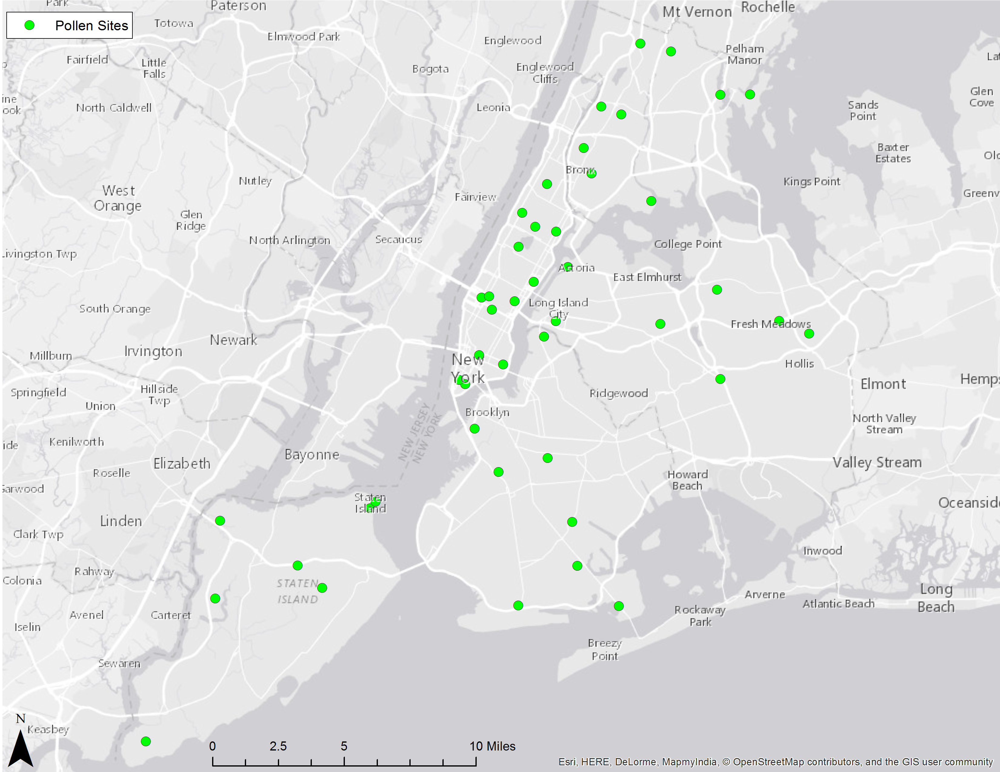
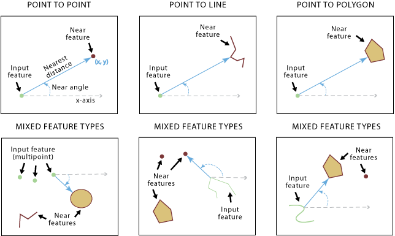
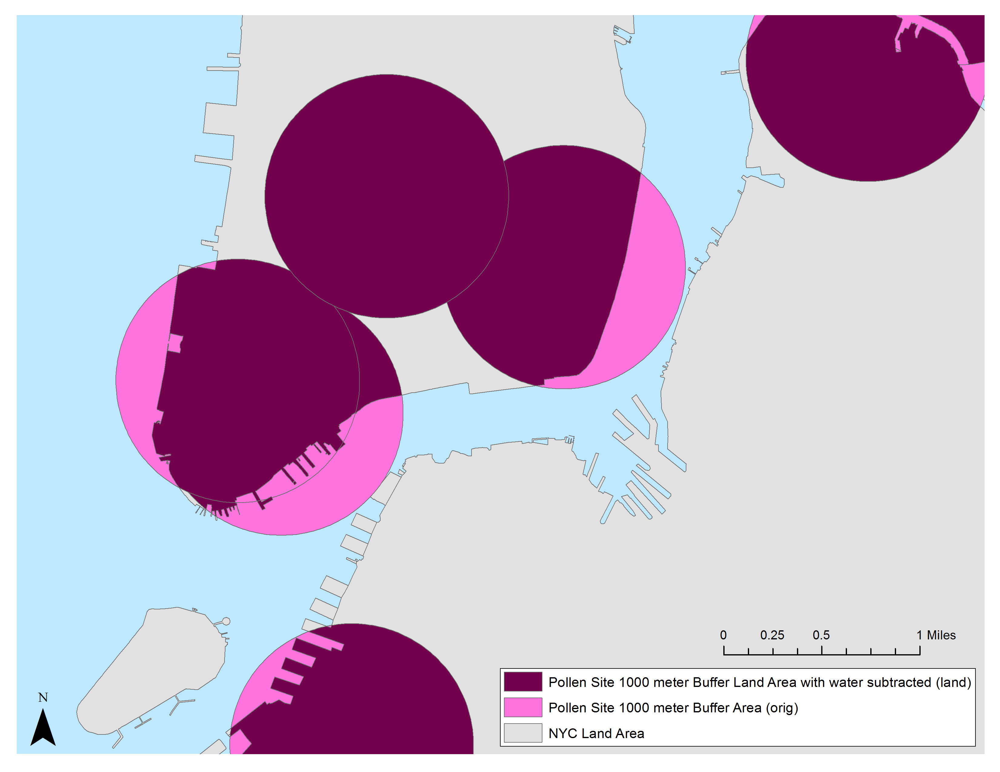
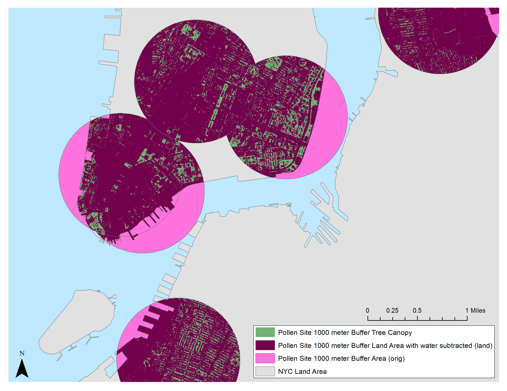
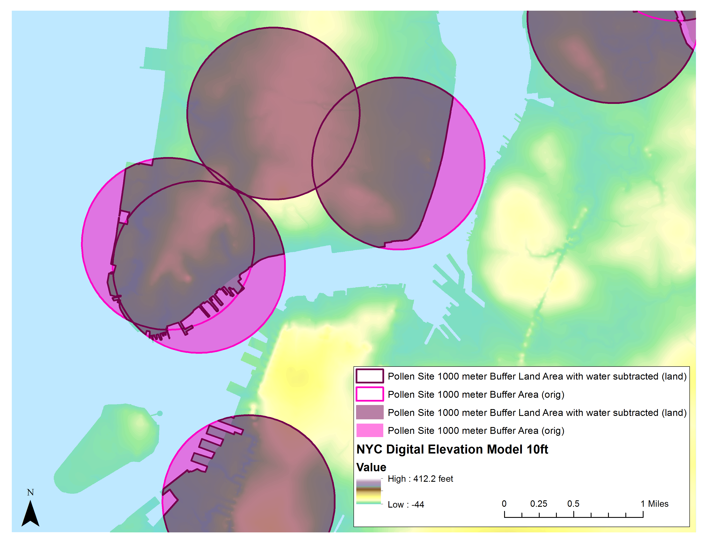
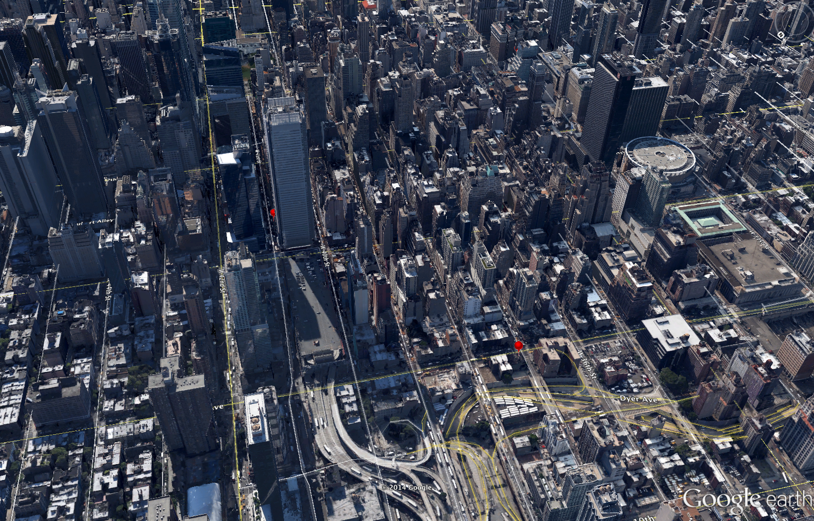
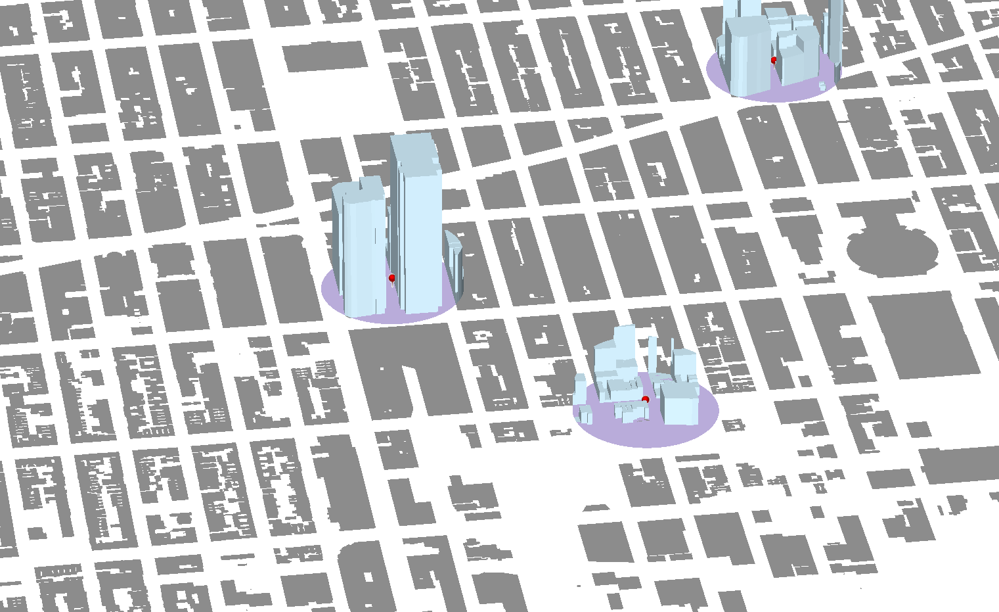
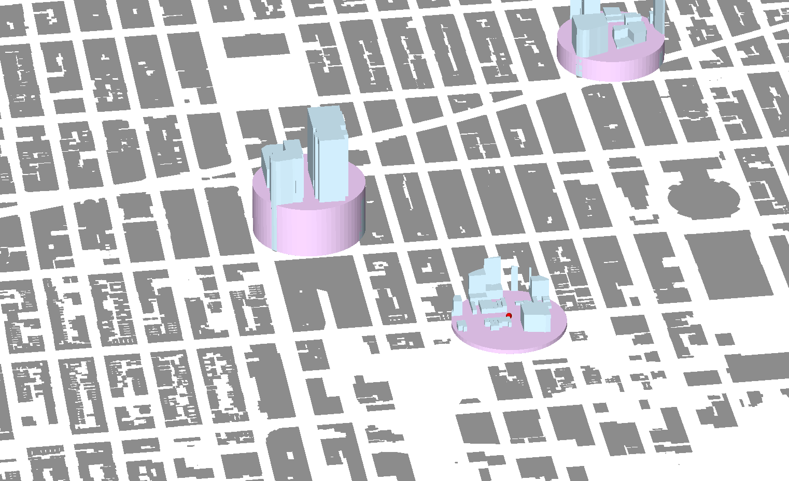
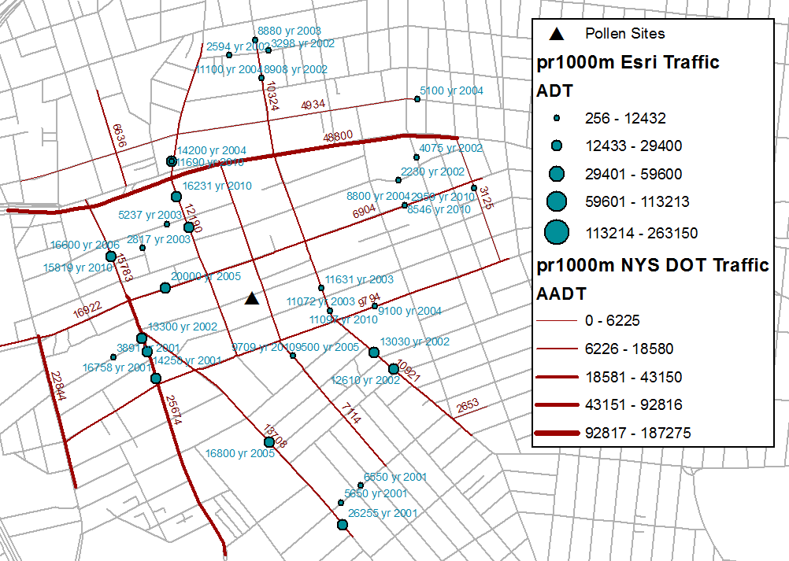

#Tree Pollen Sites and Grid Variables Data Dictionary
#####About

The following document is the data dictionary for variables pertaining to 45 locations that were used for pollen monitoring. [Kate Weinberger](mailto:krw2114@columbia.edu), PhD Candidate, at the Department of Environmental Health Sciences at the Mailman School of Public Health at Columbia University administered the site selection and pollen sampling. This data dictionary's purpose is to aid in her analysis of the pollen sites' data. These pollen sites and future analysis are being performed along with the <strong>Neighborhood Asthma and Allergy Study (NYC NAAS)</strong> study. 

#####Map of Pollen Sites

##Variables
Following is a list of variables and their corresponding definitions.
###Pollen Site IDs and coordinates
######siteid
The pollen site unique identification number. Provided by Kate Weinberger
######longitude
The pollen site longitude value in decimal degrees. 
######latitude
The pollen site latitude value in decimal degrees. 
######xcoord
The pollen site x coordinate in NAD_1983_StatePlane_New_York_Long_Island_FIPS_3104_Feet WKID: 2263 Authority: EPSG (see Projected Coordinate System information). 
######ycoord
The pollen site y coordinate in NAD_1983_StatePlane_New_York_Long_Island_FIPS_3104_Feet WKID: 2263 Authority: EPSG (see Projected Coordinate System information). 

#####Projected Coordinate System information
	NAD_1983_StatePlane_New_York_Long_Island_FIPS_3104_Feet
	WKID: 2263 Authority: EPSG

	Projection: Lambert_Conformal_Conic
	False_Easting: 984250.0
	False_Northing: 0.0
	Central_Meridian: -74.0	
	Standard_Parallel_1: 40.66666666666666
	Standard_Parallel_2: 41.03333333333333
	Latitude_Of_Origin: 40.16666666666666
	Linear Unit: Foot_US (0.3048006096012192)

	Geographic Coordinate System: GCS_North_American_1983
	Angular Unit: Degree (0.0174532925199433)
	Prime Meridian: Greenwich (0.0)
	Datum: D_North_American_1983
  		Spheroid: GRS_1980
    	Semimajor Axis: 6378137.0
    	Semiminor Axis: 6356752.314140356
    	Inverse Flattening: 298.257222101

###Pollen Site Elevation Variables
#####Method for assigning elevation data to Pollen Sites
* Esri tool [Extract Values to Points](http://resources.arcgis.com/en/help/main/10.1/index.html#//009z0000002t000000)
	* Interpolate values at the point locations (optional)
		* Specifies whether or not interpolation will be used.
		* Checked—The value of the cell will be calculated from the adjacent cells with valid values using bilinear interpolation. NoData values will be ignored in the interpolation unless all adjacent cells are NoData. 

######p_point_elev10ft
Digital elevation of Pollen Site in feet for NYC DEM 10 foot grid.

<strong>About the NYC Digital Elevation Model (DEM) 10 foot (cell resolution).</strong>
The NYC Digital Elevation Model (DEM) 10 foot (cell resolution) data layer was created by [James Quinn](mailto:jq2145@columbia.edu?subject=10 Ft Elevation DEM") of the [Built Environment and Health Group](http://beh.columbia.edu/). James used the [Topo to Raster](http://resources.arcgis.com/en/help/main/10.1/index.html#//009z0000006s000000) ArcToolbox tool. All of the input data was from NYCMap (contours, elev pts, surface waters, shorelines). Which were available to the public back in the summer of 2006. James spent a lot of time cleaning up the shoreline layer. The data was received from Sarah Williams of [Columbia University's Spatial Information and Design Lab (SIDL)](http://www.spatialinformationdesignlab.org/)

######p_point_elev01ft
Digital elevation of Pollen Site in feet for NYC DEM 1 foot grid.

<strong>About the NYC Digital Elevation Model (DEM) 1 foot (cell resolution).</strong>
The NYC Digital Elevation Model (DEM) 1 foot (cell resolution) data layer was created for NYC from a 2010 Light Detection And Ranging (LIDAR) mission. [NYC Open Data 1 foot LIDAR Derived Elevation Model](https://data.cityofnewyork.us/City-Government/1-foot-Digital-Elevation-Model-DEM-/dpc8-z3jc?category=City-Government&view_name=1-foot-Digital-Elevation-Model-DEM-)

###Pollen Site Nearness to Water Bodies Variables
#####Method for assigning near water bodies to Pollen Sites
Esri [Near Analysis](http://resources.arcgis.com/en/help/main/10.1/index.html#//00080000001q000000)

Specifies whether the near angle values in decimal degrees will be calculated and written to a new field, NEAR_ANGLE. A near angle measures from the x-axis (horizontal axis) to the direction of the line connecting an input feature to its nearest feature at their closest locations, and it is within the range of 0 to 180 or 0 to -180 decimal degrees - 0 to the east, 90 to the north, 180 (-180°) to the west, and -90 to the south.

#####Near Analysis Diagram
<!-- -->

######p_pointwaternearangle
The angle to the nearest water body. 0 to the east, 90 to the north, 180 (-180°) to the west, and -90 to the south
######p_pointwaternearfeet
The distance to the nearest water body in feet. 
######p_pointwaternearmeters
The distance to the nearest water body in meters. 

###Neighborhood Geography Areas and Land Areas
For this project the following neighborhood geography buffers were created:

####Radial Buffer Sizes List
* 0.05 km (  50 meters)( 164.042 feet) - r0050m
* 0.1  km ( 100 meters)( 328.084 feet) - r0100m
* 0.25 km ( 250 meters)( 820.210 feet) - r0250m
* 0.5  km ( 500 meters)(1640.420 feet) - r0500m
* 1    km (1000 meters)(3280.840 feet) - r1000m

Each of these buffers was then processed so that only land area of the point's residing borough was included. Buffers were allowed to cross boroughs if the borough boundaries were land based. 

#####Neighborhood Geography Areas and Land Areas Diagram

####Geography prefix (anatomy of variable):

	for - in geogsList = ['p'] #Pollen Sites
	
	for ^^^^^^ in radbufListFn = ['r0050m','r0100m','r0250m','r0500m','r1000m'] #radial buffer - distance (meters)

For example <strong>pr0500mlandsqmtrs</strong> is the variable for the pollen sites (p) radial buffer of 500 meters (r0500m) the neighborhood geography land area in meters (landsqmtrs). p + r0500m + landsqmtrs

######-^^^^^^origsqmtrs
The pollen site neighborhood geography original area (including areas over water) in square meters. 
######-^^^^^^landsqmtrs
The pollen site neighborhood geography land area (water areas removed) in square meters. 

###Neighborhood Tree Canopy Area and Percentage Variables
#####Tree Canopy Diagram

####Geography prefix (anatomy of variable):

	for - in geogsList = ['p'] #Pollen Sites
	
	for ^^^^^^ in radbufListFn = ['r0050m','r0100m','r0250m','r0500m','r1000m'] #radial buffer - distance (meters)

For example <strong>pr0500mtreecpctland</strong> is the variable for the pollen sites (p) radial buffer of 500 meters (r0500m) percent of neighborhood geography land area that is tree canopy (treecpctland). p + r0500m + treecpctland

######-^^^^^^treecsqmtrs
The amount of tree canopy area in the 50 meter buffer geography area in square meters.  
######-^^^^^^treecpctorig
The percent of neighorhood area of the neighborhood geography 50 meter buffer original area (including areas over water) covered by tree canopy.
######-^^^^^^treecpctland
The percent of neighorhood area of the neighborhood geography 50 meter buffer land area (water areas removed) covered by tree canopy.

###Neighborhood Geography Elevation Variables
#####Elevation Diagram

#####Method for assigning near water bodies to Pollen Sites
[Zonal statistics as table](http://resources.arcgis.com/en/help/main/10.1/index.html#//009z000000w8000000) for land area.

All of the following variables are constructed with the following variable name prefix configuration:

####Geography prefix (anatomy of variable):

	for - in geogsList = ['p'] #Pollen Sites
	
	for ^^^^^^ in radbufListFn = ['r0050m','r0100m','r0250m','r0500m','r1000m'] #radial buffer - distance (meters)

For example <strong>pr0500melev10ftmean</strong> is the variable for the pollen sites (p) radial buffer of 500 meters (r0500m) the 10 foot DEM elevation mean (elev10ftmean). p + r0500m + elev10ftmean
 
####NYC DEM 10 FT Resolution Variables

The NYC Digital Elevation Model (DEM) 10 foot (cell resolution) data layer was created by [James Quinn](mailto:jq2145@columbia.edu?subject=10 Ft Elevation DEM") of the [Built Environment and Health Group](http://beh.columbia.edu/). James used the [Topo to Raster](http://resources.arcgis.com/en/help/main/10.1/index.html#//009z0000006s000000) ArcToolbox tool. All of the input data was from NYCMap (contours, elev pts, surface waters, shorelines). Which were available to the public back in the summer of 2006. James spent a lot of time cleaning up the shoreline layer. The data was received from Sarah Williams of [Columbia University's Spatial Information and Design Lab (SIDL)](http://www.spatialinformationdesignlab.org/)

######-^^^^^^elev10ftcount
The pollen site neighborhood geography 50 meter buffer land area (water areas removed) count of elevation raster grid cells contributing to the zonal statistics. 
######-^^^^^^elev10ftmin
The pollen site neighborhood geography 50 meter buffer land area (water areas removed) minimum elevation raster grid cell contributing to the zonal statistics. 
######-^^^^^^elev10ftmax
The pollen site neighborhood geography 50 meter buffer land area (water areas removed) maximum elevation raster grid cell contributing to the zonal statistics. 
######-^^^^^^elev10ftmean
The pollen site neighborhood geography 50 meter buffer land area (water areas removed) mean elevation raster grid cell contributing to the zonal statistics. 
######-^^^^^^elev10ftstd
The pollen site neighborhood geography 50 meter buffer land area (water areas removed) standard deviation of raster grid cells contributing to the zonal statistics. 

####NYC DEM 1 FT Resolution Variables
The NYC Digital Elevation Model (DEM) 1 foot (cell resolution) data layer was created for NYC from a 2010 Light Detection And Ranging (LIDAR) mission. [NYC Open Data 1 foot LIDAR Derived Elevation Model](https://data.cityofnewyork.us/City-Government/1-foot-Digital-Elevation-Model-DEM-/dpc8-z3jc?category=City-Government&view_name=1-foot-Digital-Elevation-Model-DEM-)

######-^^^^^^elev01ftcount
The pollen site neighborhood geography 50 meter buffer land area (water areas removed) count of elevation raster grid cells contributing to the zonal statistics. 
######-^^^^^^elev01ftmin
The pollen site neighborhood geography 50 meter buffer land area (water areas removed) minimum elevation raster grid cell contributing to the zonal statistics. 
######-^^^^^^elev01ftmax
The pollen site neighborhood geography 50 meter buffer land area (water areas removed) maximum elevation raster grid cell contributing to the zonal statistics. 
######-^^^^^^elev01ftmean
The pollen site neighborhood geography 50 meter buffer land area (water areas removed) mean elevation raster grid cell contributing to the zonal statistics. 
######-^^^^^^elev01ftstd
The pollen site neighborhood geography 50 meter buffer land area (water areas removed) standard deviation of raster grid cells contributing to the zonal statistics. 

##Building Variables
All building data was converted to meters. Volume is in square meters. 

###Building Volume
######-^^^^^^bldgvol
The pollen site neighborhood geography (^^^^^^) buffer land area total building volume. 

###Building Bulk
######-^^^^^^bldgbulkorig
The pollen site neighborhood geography (^^^^^^) buffer land area total building volume/original area (including areas over water).
######-^^^^^^bldgbulkland
The pollen site neighborhood geography (^^^^^^) buffer land area total building volume/land area (water areas removed).
###Google Earth screenshot

###Building and neighborhood geography

###Building Volume Spread over the entire neighborhood

##Traffic Variables
The earliest birth date for children in the study cohort we're going to be estimating exposures for is in 2001, so I'd use that as the cutoff. 

	for - in geogsList = ['p'] #Pollen Sites
	
	for ^^^^^^ in radbufListFn = ['r0050m','r0100m','r0250m','r0500m','r1000m'] #radial buffer - distance (meters)

	for YYYY in YearsRange = (2001-2012) #range of years for traffic obs. some missing due to no data intersected. 

####Esri Traffic Count Variables
The Esri Traffic data was for Years: 2001 - 2012. All 0 or null Traffic Count data was removed. The data was a point file (point - see traffic.png below).

####Annual Average Daily Traffic - 2001-2012
######trafesri-^^^^^^avg_20012012
The pollen site neighborhood geography (^^^^^^) buffer land area (water areas removed) average Esri data traffic count for years: 2001 - 2012. 

####Annual Average Daily Traffic by Year - 2001-2012
######trafesri-^^^^^^avg_YYYY
The pollen site neighborhood geography (^^^^^^) buffer land area (water areas removed) average Esri data traffic count by Year (YYYY). Years: 2001 - 2012. 

####New York State (NYS) DOT (Department of Transportation) Traffic Count Variables
[NYS Traffic Data Viewer](http://gis.dot.ny.gov/tdv/)
I emailed the NYS DOT and they sent the shapefile. The Year used for this project was 2012. The data is for street segments (line - see traffic.png below).

######trafnysd-^^^^^^avg_YYYY
The pollen site neighborhood geography (^^^^^^) buffer land area (water areas removed) average NYS DOT data traffic count by Year (YYYY). 

##Notes:

####To Do:

####Completed Tasks:
* Copy input pollen data
* Project input pollen data
* Buffer Pollen Sites
* copy tree canopy data 
* copy elevation data use (DEM) I think thatts from James
* Zonal stats for elevation
* near distance to body water
* calc pct tree canopy
* copy elevation data use (DEM) I think thatts from James
* create a boro boundary clipped neighborhood geography
	* FOR THIS CYLCE THROUGH< ITERATE THROUGH INDIVIDUAL FEATURES ID, Explode, Select only features that intresect with point
* pt level elevation to point pollen points. 
* create building density metric
* find near angle image and documentation for near distance to water
* create building density illustration
* Copy Esri Traffic Data	
* Copy NYS DOT Data 2012
* copy nyccas surface and grid	
* Traffic density - wait for Kate W. to reply 
* intersect and create traffic density measures

