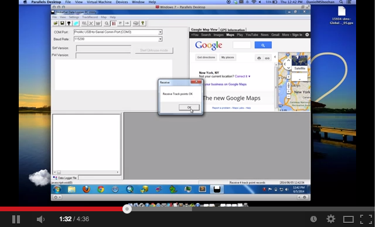
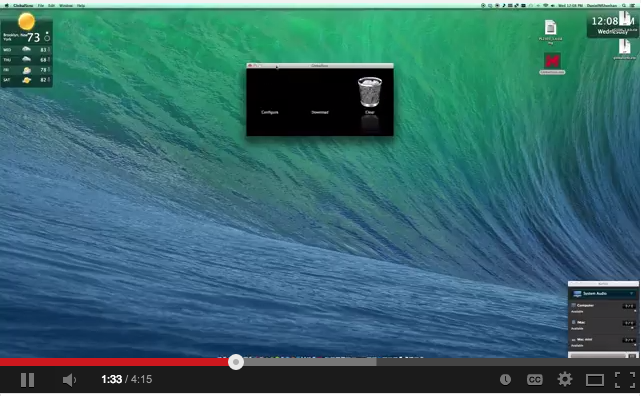

#Rio Das Pedras - GPS Field Study - Spring 2015

##File naming conventions

###GPX files

* YYYYMMDD_PID_DID.gpx (underscores between numbers, use leading zeros if necessary)

	* YYYYMMDD - Year Month and Day of data retrieval from the GPS device. 
	* PID - Participant ID (including wave ID in the PID)
	* DID - Device ID (the GPX devic ID on back # ie. 150001)

###GPX file folder structure
Each item is a folder or file, indents are subdirectories

* data
	* input
		* gpx_files
			* wave
				* 01
					* 20150316_0123_56789.gpx
					* 20150316_4321_98765.gpx
					* etc.
					* etc.
				* 02
					* 20150314_5555_56789.gpx
					* etc.
				* 03
				* 04
				* 05
				* 06

##Software & Hardware

---

###ArcGIS
* Garazi has a laptop loaded with ArcGIS 10.1 with a borrowed license. 

###[Quantum GIS(for more easily viewing GPX data)](http://www2.qgis.org/en/site/forusers/download.html)
* Install QGIS on laptop. 

####DG-100 Software and Drivers (download)
1. Download the drivers and software (Windows version). [Software and Drivers](https://github.com/nygeog/globalsat#software-and-drivers-download)
2. Install the driver. (Windows XP/ Vista/ 7 USB Drivers)
3. Install the software. (Data Utility)

[GPS software and drivers - GlobalSat website](http://www.usglobalsat.com/s-85-dg-100-support.aspx) 

* Download the Windows version

The windows software allows for more export options (according to the GlobalSat tech I spoke to on the phone) and I've used. I haven't tried the mac version yet. 

I have a video that shows the steps on how to use the software but at this point I don't think I can show or share the file b/c it includes the raw data from the DOHMH PATS. 

####GlobalSat Data Logger PC Utility (Windows) 
[BEH GlobalSat Data Logger PC Utility (Windows) Youtube Video Link](https://www.youtube.com/watch?v=nXzMpCh_Nww) 

####GlobalSync for Mac
[BEH GlobalSync for Mac Youtube Video Link](https://www.youtube.com/watch?v=PBN1F8u4G88&feature=youtu.be) 

<!--<iframe width="420" height="315" src="http://www.youtube.com/embed/PBN1F8u4G88" frameborder="0" allowfullscreen></iframe>-->
####DG-100 User Guide (pdf)
[User guide pdf](https://github.com/nygeog/globalsat/blob/master/docs/dg100_userguide.pdf?raw=true)

####DG-100 GPS+ Specifications
Link to [Spec sheet pdf](https://github.com/nygeog/globalsat/blob/master/docs/dg100_spec.pdf?raw=true)

####DG-100 GPS+ Video 
This video provides an overview of the device. 
[GlobalSat DG-100 Video](https://www.youtube.com/watch?v=-ZuWIWfxt4U) 
